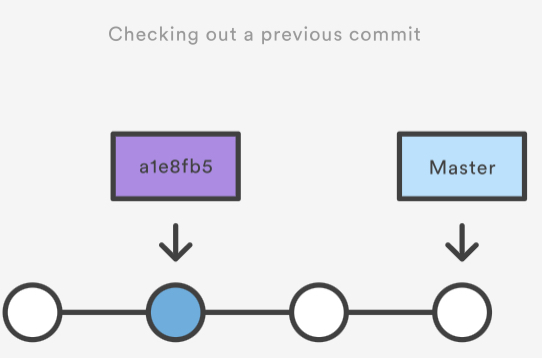

# Undoing Commits & Changes

```bash
git checkout
git clean
git revert
git reset
git rm
```

In this section, we will discuss the available `undo` Git strategies and commands. It is first important to note that Git does not have a trditional `undo` system like those found in a word processing application. It will be beneficial to refrain from mapping Git operations to any traditinoal `undo` mental model. Additionaly, Git has its own nomenclature for `undo` operations that it is best to leverage in a discussion. This nomenclature includes terms like `reset`, `revert`, `checkout`, `clean` and more.

A fun metaphor is to think of Git as a timeline management utility. Commits are snapshots of a point in time or points of interest along the timeline of a projects' history. Additionally, multiple timelines can be managed through the use of branches. When `undoing` in Git, you are usually moving back in time, or to another timeline when mistakes didn't happen.

This tutorial provides all of the necessary skills to work with previously revisions of a software project. First, it shows you how to explore old commits, then it explaines the difference between reverting public commits in the project thistory vs. resetting unpublished changes on your local machine.

## Finding what is lost: Reviewing old commits

The whole idea behind any version control system is to store "safe" copies of a project so that you never have to worry about irreparably breaking your code base. Once you've built up a project history of commits, you can review and revisit any commit in the history. One of the best utility for reviewing the history of a Git repository is the `git log` command. In the example below, we use `gitlog` to get a list of the latest commits to a popular open-source graphics library.

```bash
git log —-oneline 
e2f9a78fe Replaced FlyControls with OrbitControls 
d35ce0178 Editor: Shortcuts panel Safari support. 
9dbe8d0cf Editor: Sidebar.Controls to Sidebar.Settings.Shortcuts. Clean up. 
05c5288fc Merge pull request #12612 from TyLindberg/editor-controls-panel 
0d8b6e74b Merge pull request #12805 from harto/patch-1 
23b20c22e Merge pull request #12801 from gam0022/improve-raymarching-example-v2 
fe78029f1 Fix typo in documentation 
7ce43c448 Merge pull request #12794 from WestLangley/dev-x 
17452bb93 Merge pull request #12778 from OndrejSpanel/unitTestFixes 
b5c1b5c70 Merge pull request #12799 from dhritzkiv/patch-21 
1b48ff4d2 Updated builds. 
88adbcdf6 WebVRManager: Clean up. 
2720fbb08 Merge pull request #12803 from dmarcos/parentPoseObject 
9ed629301 Check parent of poseObject instead of camera 
219f3eb13 Update GLTFLoader.js 
15f13bb3c Update GLTFLoader.js 
6d9c22a3b Update uniforms only when onWindowResize 881b25b58 Update ProjectionMatrix on change aspect
```

Each commit has a unique SHA-1 identifying hash. These IDs are used to travel through the committed timeline and revisit commits. By default, `git log` will only show commits for the currently selected branch. It is entirely possible that the commit you're looking for is on another branch. You can view all commits across all branches by executing `git log --branches=*`. The command `git branch` is used to view and visit other branches. Invoking the command, `git branch -a` will return a list of all known branch names. One of these branch names can then be logged using `git log`.

When you have found a commit reference to the point in history you wwnat to visit, you can utilize the `git checkout` command to visit that commit. `Git checkout` is an easy way to "load" any of these saved snapshots onto your developement machine. During the normal course of development, the `HEAD` usually points to `master` or some other local branch, but when you check out a previous commit, `HEAD` no longer points to a branch--it points directly to a commit. This is called a "detached HEAD" state, and it can be visualized as the following:



Checking out an old file does not move the `HEAD` pointer. It remains on the same branch and same commit, avoiding a `detached head` state. You can then commit the old version of the file in a new snapshot as you would any other cahges. So, in effect, this usage of `git checkout` on a file, serves as a way to revert back to an old version of an individual file. Fore more information on these two modes visit the `git checkout` page.
